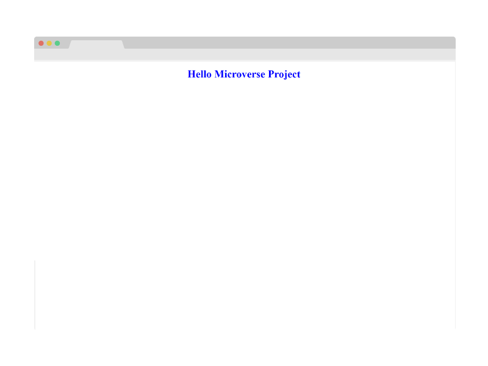

# Project Name

> This is my first project in Microverse, where I applied Linters, HTML & CSS, Git & Github.

This HTML and CSS file just shows a simple H1 Tag, we are just getting started!

## Built With

- HTML & CSS
- Linters
- Git & Github

## Getting Started

**This is an example of how you may give instructions on setting up your project locally.**

To get a local copy up and running follow these simple example steps.

### Prerequisites

- Git in your local machine
- Code editor (VS code, Atom, etc)
- Terminal

### Setup

- git clone https://github.com/RafaelEchart/HelloMicroverseProject.git
- cd HelloMicroverseProject

### Usage

- Add the changes you want and feel free to push it into a new Branch!

### Run tests

- Check that all the tests are correctly passed🤝

### Merge

- Merge it with the main branch so we can all see your work!!🤝

## Authors

👤 **Author1**

- GitHub: [@rafaelechart](https://github.com/rafaelechart)
- Twitter: [@rafaechart](https://twitter.com/rafaechart)

## 🤝 Contributing

Contributions, issues, and feature requests are welcome!

## Show your support

Give a ⭐️ if you like this project!

## Acknowledgments

- Microverse documentation and Myself ⭐️

## 📝 License

This project is [MIT](./MIT.md) licensed.
